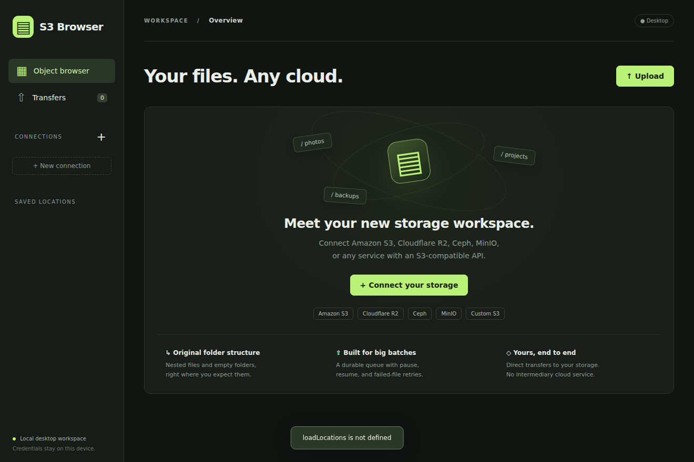

# S3 Browser

A local desktop browser for Amazon S3, Cloudflare R2, Ceph RGW, MinIO, and custom S3-compatible endpoints. Browse and organize objects, queue uploads and folder downloads, inspect object versions and metadata, and review one-way folder syncs. Built with Electron, the AWS SDK, and a persistent SQLite transfer queue.



## Run

The features below describe the current source. Existing **0.1.1 binaries have not been rebuilt for this expansion**; run from source to use the new workflows, or build fresh packages with the commands below.

Existing native Linux x86_64 packages are in `dist/native/`:

| Distribution    | Package                                      | Install                                                                   |
| --------------- | -------------------------------------------- | ------------------------------------------------------------------------- |
| Arch / ALPM     | `alpm/s3-browser-0.1.1-1-x86_64.pkg.tar.zst` | `sudo pacman -U ./dist/native/alpm/s3-browser-0.1.1-1-x86_64.pkg.tar.zst` |
| Debian / Ubuntu | `deb/s3-browser_0.1.1-1_amd64.deb`           | `sudo apt install ./dist/native/deb/s3-browser_0.1.1-1_amd64.deb`         |
| Fedora / RPM    | `rpm/s3-browser-0.1.1-1.x86_64.rpm`          | `sudo dnf install ./dist/native/rpm/s3-browser-0.1.1-1.x86_64.rpm`        |

After installation, open **S3 Browser** from your application menu or run `s3-browser`. Your connections and transfer history stay in your user profile when the package is removed. See [packaging documentation](packaging/README.md) for build and validation details.

A portable alternative is `dist/s3-browser-0.1.1-linux-x64.tar.gz`: extract it and open `s3-browser` inside the extracted folder. Keep its accompanying files together. In this workspace, `dist/linux-unpacked/s3-browser` can also be launched directly.

To run from source, install Node.js 22.13 or later and a recent npm:

```sh
npm ci
npm start
```

If your npm configuration blocks Electron's install script, run `node node_modules/electron/install.js` once. A graphical desktop is required. Chromium's sandbox remains enabled in normal use.

## Connect and upload

1. Choose **Connect your storage**, select the provider, and enter your credentials and endpoint.
2. Select a bucket or enter its name directly. A default bucket avoids requiring permission to list every bucket.
3. Browse to the destination and choose **Upload**. Choose an entire folder or multiple files, set a prefix and concurrency, and choose whether to skip or replace existing keys.
4. Select your local source in the native file picker. The app scans it into a durable queue without loading file contents.
5. Review the destination and object count in **Transfers**, then choose **Start upload**. Use **Pause**, **Resume upload**, **Retry failed**, **Cancel**, and **Details** as needed. **Settings** controls concurrency, bandwidth, and additional attempts; **Export failures** saves a JSON failure report.

Selecting `/home/me/Photos` at prefix `archive/` creates:

```text
archive/Photos/
archive/Photos/2026/
archive/Photos/2026/image.jpg
archive/Photos/empty-folder/
```

The selected folder's own name is included. Nested paths, Unicode names, hidden files, file contents, and empty directories are preserved. S3 stores object keys, so directories are represented by zero-byte keys ending in `/`. Symlinks and special files are skipped and counted. Filesystem permissions, ownership, hard-link relationships, and modification times are not restored as filesystem metadata. Source files must remain available and unchanged until their upload finishes.

## Browse, select, and download

Use the prefix field to navigate directly, **Bookmark** to save a connection/bucket/prefix location, and the recent-location shortcuts to revisit previous locations. Bookmarks and recent locations persist locally.

Checkboxes select files or folders; the header checkbox selects visible rows. Selection resets when loading another page or location. Name, size, and date sorting applies to the loaded page, with folders first. The normal browser loads up to 500 entries per page, and typing in its filter narrows that page. **Search prefix** searches object keys recursively beneath the current prefix, case-insensitively. Each search request scans at most five pages of 500 keys; use the next-page control to continue even when a batch has no matches. Sorting search results also applies only to the current result batch.

Choose **Download selected** or an object's download button, select skip or replace for existing local files, and choose a local destination folder. A selected remote folder expands across all listing pages. Paths relative to the current remote prefix are preserved, overlapping selections are deduplicated, and empty folder markers create local directories. Start the resulting download batch in **Transfers**.

Downloads use temporary files and publish completed files only after checking the expected size. Remote ETag conditions detect changed source objects. Unsafe or nonportable names, case/Unicode path collisions, file/folder conflicts, and destination symlinks are rejected; some valid S3 keys therefore cannot be downloaded through this workflow. Downloads restore bytes and directory structure, without restoring filesystem ownership, permissions, or timestamps.

## Organize objects

**+ Folder** creates a zero-byte folder marker. **Copy**, **Move**, and **Delete** expand selected folders recursively and show the exact object keys for confirmation. Copy and move accept a destination bucket and prefix on the current connection and preserve paths relative to the current source prefix. Existing destination objects are never replaced; choose a different destination when a key conflicts. Overlapping source and destination selections are rejected.

Operations recheck reviewed source snapshots and send conditional requests. A move copies each object, verifies its destination size and returned ETag/version, then conditionally deletes its source. Large objects use multipart server-side copy. These batches are not atomic: successful objects remain processed if another object fails, and a failed move can leave a destination copy with the source retained. The result identifies failures for review. Operations run directly after confirmation; they are not durable, pausable transfer jobs. Preview tokens expire after one hour or when the app closes.

## Object details and maintenance

Click an object name to inspect its size, ETag, storage class, content type, and user metadata. Editing metadata replaces the whole user metadata map through server-side copy, while preserving object bytes and supported existing attributes. Review and confirm the replacement before saving.

The same dialog can generate and copy an expiring download link, with a lifetime from one second to seven days. Anyone holding the link can download the object until it expires; temporary credentials may expire sooner. Version history supports pagination and restoring a selected data version as a new current version. Delete markers cannot be restored, and history requires provider support and bucket versioning.

**Multipart cleanup** lists unfinished uploads with pagination. Select uploads, review the list, and confirm aborting them to release their unfinished parts. It does not delete completed objects. Listing, versioning, metadata copy, conditional requests, and multipart APIs vary by provider and permissions; unsupported or denied operations report errors. Configure an incomplete-multipart lifecycle rule as well to cover remnants after crashes or network loss.

## Review a one-way folder sync

Choose **Sync folder**, select a local folder, and inspect the comparison before **Confirm & queue sync**. Sync maps the folder's **contents** directly into the current prefix: `/home/me/Photos/image.jpg` at `archive/` becomes `archive/image.jpg`. Ordinary folder upload includes `Photos/` as shown above. Sync is an explicit one-way local-to-remote operation, without watching the folder or downloading remote changes.

The preview classifies new, changed, unchanged, remote-only, conflicting, and skipped paths. It reads local files to calculate checksums, compares sizes and supported full-object checksums or suitable single-part MD5 ETags, and treats uncertain equality as changed. Multipart ETags are not treated as file MD5 hashes. Symlinks and special files are skipped; remote paths overlapping skipped or conflicting local paths are protected from deletion.

Remote deletion is **off by default**. Enabling it includes reviewed remote-only keys in the plan. Applying rechecks the local tree and remote snapshots, then creates a transfer batch for new and changed entries. Start that batch in **Transfers**. New keys use create-only conditions and replacements use the reviewed ETag, so changed remote targets fail instead of being overwritten unconditionally. Local source checks also run before upload; keep the source unchanged throughout the run.

Reviewed deletions run only after every queued upload succeeds. Before cleanup, the app checks the local tree and deletion targets again, then conditionally deletes matching remote objects. A failed upload prevents cleanup; changed sources or deletion targets stop cleanup. Sync plans and cleanup status survive restarts, and failed cleanup can be retried from **Transfers**. Sync is not a transaction: completed uploads and deletions are retained after later failures.

## Providers

| Provider       | Endpoint                                                                                    | Region                                        | Path-style    |
| -------------- | ------------------------------------------------------------------------------------------- | --------------------------------------------- | ------------- |
| Cloudflare R2  | `https://<ACCOUNT_ID>.r2.cloudflarestorage.com` (or your jurisdiction-specific S3 endpoint) | `auto`                                        | Usually off   |
| Amazon S3      | Leave blank for the AWS endpoint                                                            | Your bucket's region                          | Usually off   |
| Ceph RGW       | Your gateway, e.g. `https://s3.example.com`                                                 | Your deployment's region; default `us-east-1` | On by default |
| MinIO / custom | Your S3 API endpoint, including port if needed                                              | Your deployment's region                      | On by default |

For R2, use **S3 access key ID and secret**, not a general Cloudflare API bearer token. See [Cloudflare's SDK configuration](https://developers.cloudflare.com/r2/examples/aws/aws-sdk-js-v3/). Ceph must expose its [Object Gateway S3 API](https://docs.ceph.com/en/latest/radosgw/), not a Swift endpoint. Compatibility varies by server/version and enabled features.

Credentials need bucket listing permission for browsing, object write permission for uploads, object read permission for downloads and skip-existing checks, and multipart upload/abort permission for large files. Copy and metadata workflows may also need tagging permissions; deletes, version access, and multipart listing need their respective permissions. Listing all buckets is optional. A `403` on an existence check is treated as a failure rather than assuming the object is missing. Skip uploads send `If-None-Match: *`; ordinary upload replace mode intentionally permits overwrites. Reviewed operations and sync retain their conditional guards and do not retry without them when a provider rejects them. HTTPS uses normal certificate validation. Private CAs can be supplied through `NODE_EXTRA_CA_CERTS` when launching from a configured environment.

## Queue behavior and limits

- SQLite stores upload/download manifests and each object's status, not file contents or credentials. Transfer details are paginated in groups of 100. Upload folder scanning inserts entries in bounded batches. Download, operation, and sync previews materialize their manifests in memory; very large selections can take substantial time and memory, especially sync hashing and full review lists. Split large workloads into smaller prefixes when practical.
- Default concurrency is six files, configurable from one to sixteen in **Settings**. Each large upload uses one multipart worker with parts of at least 8 MiB, increased for large objects to stay within 10,000 parts. Active-transfer buffering depends on concurrency and part size. A bandwidth limit in MiB/s is shared across the batch's workers; zero means unlimited. Displayed speed and ETA are estimates.
- The SDK retries transient request failures up to five attempts. Queue settings add zero to ten whole-file retries, defaulting to two, on top of request retries. Failed entries remain visible for manual retry or JSON export.
- Pause interrupts active file requests and attempts to clean up multipart uploads. Resume restarts unfinished files from byte zero. Completed objects stay completed. Cancel stops unfinished work without undoing completed objects. This is file-level recovery, not multipart byte-offset recovery.
- Closing the app pauses the queue; reopening never automatically starts transfers. **Automatically start the next queued batch** is opt-in for the current session, and the first batch must be started manually. Pausing disables automatic progression. A crash during a scan requires selecting the source again; interrupted file transfers recover as pending.
- Ordinary upload and download skip modes check destination existence, not content equality. Their replace modes intentionally overwrite matching destinations. Uploading alone does not delete unrelated remote objects; remote deletion is a separate reviewed operation or an explicitly enabled sync option.
- One transfer batch runs at a time. You can browse or prepare other batches while transferring. The app prevents system idle suspension during an active batch, but cannot prevent shutdowns or all lid-close policies.
- Saved credentials are encrypted with Electron's OS-backed secure storage. On Linux, insecure `basic_text` storage is rejected. Without an OS keyring, use session-only credentials. After restarting, session-only connections are gone; create a new connection and batch with skip-existing enabled to continue. Locked saved connections become usable after unlocking the keyring and restarting.
- Queue and sync metadata include local paths and remote keys, stored alongside bookmarks and recent locations in Electron's application data directory (`~/.config/s3-browser` on typical Linux installations). This metadata is not encrypted. Removing a batch only removes local history, not transferred objects or files.

## Development and verification

```sh
npm test              # Unit tests; backend integrations skip without an endpoint
npm run test:desktop  # Electron smoke test; requires a display
npm run test:desktop:expansion # Expanded workflows; requires a display and S3_TEST_ENDPOINT
npm run dist          # Native DEB, RPM and ALPM packages (requires Docker)
npm run dist:portable # Portable Linux tar.gz archive
npm run pack          # Unpacked desktop application
```

Backend integration tests are enabled by `S3_TEST_ENDPOINT` and use dedicated temporary buckets. A local test service can be started with:

```sh
docker run --rm --name s3browser-test-storage \
  -p 127.0.0.1:19000:9000 \
  -e MINIO_ROOT_USER=s3browser-test \
  -e MINIO_ROOT_PASSWORD=s3browser-test-secret \
  quay.io/minio/minio:RELEASE.2025-09-07T16-13-09Z server /data
```

In another terminal:

```sh
S3_TEST_ENDPOINT=http://127.0.0.1:19000 npm test
S3_TEST_ENDPOINT=http://127.0.0.1:19000 npm run test:desktop
S3_TEST_ENDPOINT=http://127.0.0.1:19000 npm run test:desktop:expansion
S3_TEST_ENDPOINT=http://127.0.0.1:19000 npm run test:scale
```

Override `S3_TEST_ACCESS_KEY` and `S3_TEST_SECRET_KEY` for backend tests if needed. The desktop smoke test uses the local credentials above. The opt-in scale test creates 49,500 small files and 500 directories, uploads and counts all 50,000 objects, then removes its temporary bucket and local files. Use a disposable local service; these tests issue writes, reads, and deletes in their own newly created bucket.

The original and expansion backend suites have run against the disposable MinIO service. They exercise Unicode paths, empty folders, multipart uploads, queued downloads, skip/replace behavior, source-change rejection, copy/move/delete, metadata replacement, signed-link downloads, recursive search across 2,505 keys, reviewed sync and conditional cleanup, version restore, and multipart abort. Unsupported bucket versioning may be skipped on other backends. Large multipart-copy branches are covered with simulated SDK responses rather than live multi-gigabyte objects.

The desktop smoke test uses the real Electron window and actual IPC. Existing Linux 0.1.1 artifacts were built previously; they do not establish packaging validation for these source changes. Windows/macOS build targets are configured but have not been built or tested. Live R2 and Ceph accounts have not been tested.
